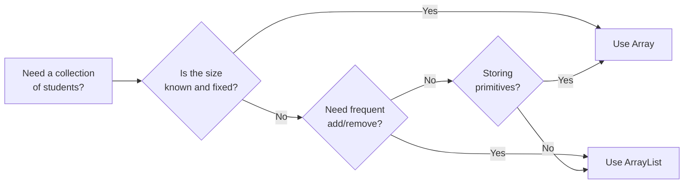

# Array vs ArrayList in Java — A Detailed Comparison

> A comprehensive comparison of Java Arrays and ArrayList, with examples from the Student Record Management System project.

---

## 📖 1. Introduction

### What is an Array?

An **Array** is a fixed-size, contiguous block of memory that stores elements of the same data type. Arrays are a fundamental data structure in Java and are part of the language itself (not part of any library). Once created, the size of an array cannot be changed.

```java
// Declaring and initializing an array
Student[] students = new Student[100];  // Fixed size of 100
int[] marks = {85, 90, 78, 92, 88};    // Array with initial values
```

### What is an ArrayList?

An **ArrayList** is a resizable array implementation provided by the `java.util` package as part of the Java Collections Framework. It automatically grows and shrinks as elements are added or removed. Internally, it uses a regular array but handles resizing automatically.

```java
// Declaring and initializing an ArrayList
ArrayList<Student> students = new ArrayList<>();  // Dynamic size
students.add(new Student(1001, "Rahul", "CSE", 18));
```

---

## 📊 2. Detailed Comparison Table

| # | Feature | Array | ArrayList |
|---|---------|-------|-----------|
| 1 | **Definition** | Fixed-size data structure built into Java language | Resizable-array implementation of the `List` interface |
| 2 | **Size** | Fixed — must be specified at creation time | Dynamic — grows and shrinks automatically |
| 3 | **Type Safety** | Can hold both primitives and objects | Only holds objects (uses wrapper classes for primitives) |
| 4 | **Syntax** | `Student[] arr = new Student[10];` | `ArrayList<Student> list = new ArrayList<>();` |
| 5 | **Access Performance** | O(1) — direct index access | O(1) — index-based access via `get()` method |
| 6 | **Insertion Performance** | O(n) — need to shift elements manually | O(n) — shifting handled internally, O(1) amortized at end |
| 7 | **Deletion Performance** | O(n) — need to shift elements and track size | O(n) — shifting handled internally by `remove()` |
| 8 | **Memory** | Compact — stores elements directly | Slightly more overhead — stores object references + internal array |
| 9 | **Primitives Support** | ✅ Yes (`int[]`, `double[]`, `char[]`) | ❌ No (must use `Integer`, `Double`, `Character`) |
| 10 | **Iteration** | For loop, enhanced for loop | For loop, enhanced for loop, Iterator, forEach, Stream |
| 11 | **Thread Safety** | Not synchronized | Not synchronized (use `Collections.synchronizedList()` if needed) |
| 12 | **Generics** | ❌ No generic support | ✅ Full generic support (`ArrayList<Student>`) |
| 13 | **Built-in Methods** | Only `length` property and `Arrays` utility class | Rich API: `add()`, `remove()`, `contains()`, `sort()`, `indexOf()`, etc. |
| 14 | **Flexibility** | Low — manual management required | High — automatic resizing and rich built-in methods |
| 15 | **Import Required** | ❌ No import needed | ✅ `import java.util.ArrayList;` |
| 16 | **Multidimensional** | ✅ Supported (`int[][]`) | ⚠️ Possible but verbose (`ArrayList<ArrayList<Integer>>`) |
| 17 | **Length / Size** | `.length` property | `.size()` method |
| 18 | **Null Elements** | ✅ Can store null | ✅ Can store null |

---

## 💻 3. Code Examples — Same Operations Compared

### 3.1 Adding a Student

**Using Array:**
```java
// Array approach — must track size manually
Student[] students = new Student[100];
int count = 0;  // Must track the actual number of students

public boolean addStudent(Student s) {
    // Check if array is full
    if (count >= students.length) {
        System.out.println("Error: Array is full! Cannot add more students.");
        return false;
    }
    // Check for duplicate ID
    for (int i = 0; i < count; i++) {
        if (students[i].getStudentId() == s.getStudentId()) {
            System.out.println("Error: Student ID already exists!");
            return false;
        }
    }
    students[count] = s;
    count++;  // Must manually increment counter
    return true;
}
```

**Using ArrayList:**
```java
// ArrayList approach — clean and simple
ArrayList<Student> students = new ArrayList<>();

public boolean addStudent(Student s) {
    // Check for duplicate ID
    for (Student existing : students) {
        if (existing.getStudentId() == s.getStudentId()) {
            System.out.println("Error: Student ID already exists!");
            return false;
        }
    }
    students.add(s);  // Automatically handles sizing
    return true;
}
```

> **Verdict:** ArrayList code is shorter, cleaner, and doesn't require manual size tracking.

---

### 3.2 Removing a Student by ID

**Using Array:**
```java
// Array approach — must shift elements manually
public boolean deleteStudent(int studentId) {
    int index = -1;
    // Find the student
    for (int i = 0; i < count; i++) {
        if (students[i].getStudentId() == studentId) {
            index = i;
            break;
        }
    }
    if (index == -1) return false;

    // Shift all elements after the deleted one
    for (int i = index; i < count - 1; i++) {
        students[i] = students[i + 1];
    }
    students[count - 1] = null;  // Clear last reference
    count--;  // Decrement counter
    return true;
}
```

**Using ArrayList:**
```java
// ArrayList approach — built-in removal
public boolean deleteStudent(int studentId) {
    for (int i = 0; i < students.size(); i++) {
        if (students.get(i).getStudentId() == studentId) {
            students.remove(i);  // Handles shifting internally
            return true;
        }
    }
    return false;
}
```

> **Verdict:** ArrayList handles element shifting internally, reducing code complexity and the risk of bugs.

---

### 3.3 Searching by Name (Partial Match)

**Using Array:**
```java
// Array approach — must use separate result array or counter
public Student[] searchByName(String name) {
    Student[] results = new Student[count];  // Worst case: all match
    int resultCount = 0;

    for (int i = 0; i < count; i++) {
        if (students[i].getName().toLowerCase().contains(name.toLowerCase())) {
            results[resultCount] = students[i];
            resultCount++;
        }
    }
    // Must also return resultCount separately, or create a properly-sized array
    Student[] trimmed = new Student[resultCount];
    System.arraycopy(results, 0, trimmed, 0, resultCount);
    return trimmed;
}
```

**Using ArrayList:**
```java
// ArrayList approach — dynamic result list
public ArrayList<Student> searchByName(String name) {
    ArrayList<Student> results = new ArrayList<>();

    for (Student s : students) {
        if (s.getName().toLowerCase().contains(name.toLowerCase())) {
            results.add(s);
        }
    }
    return results;  // Exactly the right size, no wasted space
}
```

> **Verdict:** ArrayList makes returning variable-sized search results natural and efficient.

---

### 3.4 Sorting Students

**Using Array:**
```java
// Array approach — use Arrays.sort() with Comparator
import java.util.Arrays;
import java.util.Comparator;

Arrays.sort(students, 0, count, new Comparator<Student>() {
    @Override
    public int compare(Student a, Student b) {
        return a.getName().compareToIgnoreCase(b.getName());
    }
});
// Must pass 0 and count to avoid sorting null elements
```

**Using ArrayList:**
```java
// ArrayList approach — use Collections.sort()
import java.util.Collections;
import java.util.Comparator;

Collections.sort(students, (a, b) -> 
    a.getName().compareToIgnoreCase(b.getName())
);
// No need to track size — ArrayList knows its own size
```

> **Verdict:** Both approaches work, but ArrayList avoids the risk of sorting null elements.

---

## ⚡ 4. Performance Analysis — Big O Comparison

| Operation | Array | ArrayList | Notes |
|-----------|-------|-----------|-------|
| **Access by index** | O(1) | O(1) | Both offer constant-time random access |
| **Search (unsorted)** | O(n) | O(n) | Both require linear scan |
| **Insert at end** | O(1) | O(1) amortized | ArrayList may need to resize (copy), but amortized O(1) |
| **Insert at index** | O(n) | O(n) | Both need to shift elements |
| **Delete by index** | O(n) | O(n) | Both need to shift elements |
| **Delete by value** | O(n) | O(n) | Search + shift |
| **Sort** | O(n log n) | O(n log n) | Both use efficient sorting algorithms |
| **Size check** | O(1) but manual | O(1) via `.size()` | Array requires manual tracking |

> **Key Insight:** The time complexities are identical. The difference is in code simplicity and safety, not raw performance.

---

## 🧠 5. Memory Analysis

### Array Memory Layout

```
Array of Student[5]:
┌──────────┬──────────┬──────────┬──────────┬──────────┐
│ ref[0]   │ ref[1]   │ ref[2]   │ ref[3]   │ ref[4]   │
│ → Student│ → Student│ → Student│ null     │ null     │
└──────────┴──────────┴──────────┴──────────┴──────────┘
          ↑ Only 3 students, but 5 slots allocated
          ↑ Wasted memory for empty slots
```

- **Fixed allocation:** All memory is allocated upfront
- **Wasted space:** Empty slots still consume memory for references
- **No overhead:** Minimal object header (array length stored once)

### ArrayList Memory Layout

```
ArrayList<Student> (size=3, capacity=10):
┌────────────────────────────────────┐
│ ArrayList object                   │
│  - size: 3                         │
│  - elementData: Object[10]         │
│    ┌────┬────┬────┬────┬...┬────┐  │
│    │ref0│ref1│ref2│null│   │null│  │
│    └────┴────┴────┴────┴...┴────┘  │
└────────────────────────────────────┘
```

- **Dynamic allocation:** Starts with default capacity (10), grows by 50% when full
- **Growth strategy:** New capacity = old capacity + (old capacity >> 1)
- **Slight overhead:** ArrayList object itself + internal array + size tracking

### Memory Comparison for 100 Students

| Aspect | Array (`Student[100]`) | ArrayList (100 elements) |
|--------|----------------------|--------------------------|
| Reference storage | 100 × 8 bytes = 800 bytes | ~150 × 8 bytes = 1200 bytes (capacity 150 after growth) |
| Object overhead | 16 bytes (array header) | 40+ bytes (ArrayList object + internal array header) |
| **Total overhead** | **~816 bytes** | **~1240 bytes** |
| Difference | Baseline | ~50% more memory for references |

> **Conclusion:** Arrays are more memory-efficient, but the difference is negligible for typical project sizes (hundreds of records). The convenience of ArrayList far outweighs the small memory cost.

---

## ✅ 6. Why ArrayList Was Chosen for This Project

| # | Reason | Explanation |
|---|--------|-------------|
| 1 | **Unknown number of students** | We don't know in advance how many students will be added. ArrayList grows automatically, while an Array requires a fixed size at creation. |
| 2 | **Frequent add/delete operations** | Students are added and removed dynamically. ArrayList's `add()` and `remove()` methods handle element shifting internally, reducing code complexity. |
| 3 | **Built-in search and sort support** | `Collections.sort()` works directly with ArrayList. Sorting arrays requires careful handling of null elements and manual size tracking. |
| 4 | **Clean, readable code** | ArrayList's methods like `add()`, `remove()`, `get()`, `size()`, and `contains()` produce shorter, more readable code compared to manual array management. |
| 5 | **Return type flexibility** | Search methods naturally return `ArrayList<Student>` results of variable size, avoiding the need for helper arrays or separate size counters. |

---

## ⚖️ 7. When to Use Arrays Instead

Despite ArrayList's advantages, there are legitimate cases where arrays are the better choice:

| Scenario | Why Array is Better |
|----------|-------------------|
| **Fixed-size data** | When the size is known and will never change (e.g., days of the week, months) |
| **Primitive types** | Arrays support `int[]`, `double[]` directly; ArrayList requires boxing (`Integer`, `Double`), which costs memory and performance |
| **Performance-critical code** | Arrays have slightly less overhead; in tight loops processing millions of elements, this matters |
| **Multidimensional data** | `int[][]` is cleaner than `ArrayList<ArrayList<Integer>>` for matrices |
| **Interop with legacy code** | Many older APIs and library methods expect array parameters |
| **Memory-constrained environments** | Arrays use less memory per element due to no wrapper objects |

### Example: GPA Array (Fixed Size)

```java
// Array is appropriate here — we know the exact number of semesters
double[] semesterGPAs = new double[8];  // 8 semesters in B.E.
semesterGPAs[0] = 8.5;
semesterGPAs[1] = 9.0;
double cgpa = GradeCalculator.calculateCGPA(semesterGPAs);
```

---

## 📈 8. Visual Summary



---

## 🏁 9. Conclusion

Both **Arrays** and **ArrayLists** are important data structures in Java, and a good Java programmer should understand both. They have identical time complexities for most operations, but differ significantly in ease of use and flexibility.

For this **Student Record Management System**, `ArrayList` is the clear winner because:
- The number of students is unknown and changes dynamically
- The built-in methods reduce code complexity and potential bugs
- Sorting and searching are simpler with the Collections Framework
- Code readability and maintainability are improved

However, arrays remain essential for fixed-size data, primitive types, and performance-critical applications. Understanding both data structures — their strengths, weaknesses, and appropriate use cases — is a fundamental skill for every Java developer.

---

*This comparison was prepared as part of the educational documentation for the Student Record Management System mini-project.*
