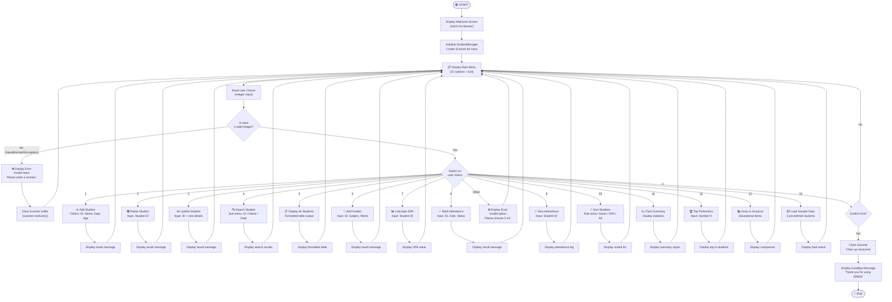
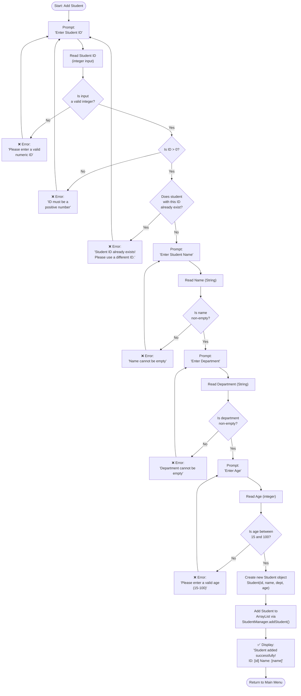
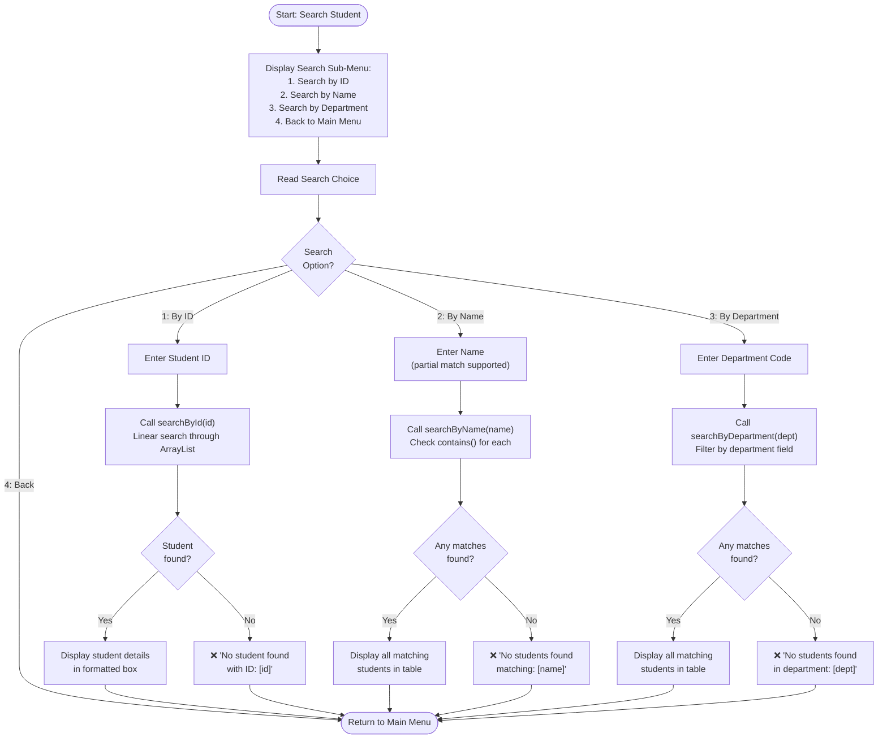
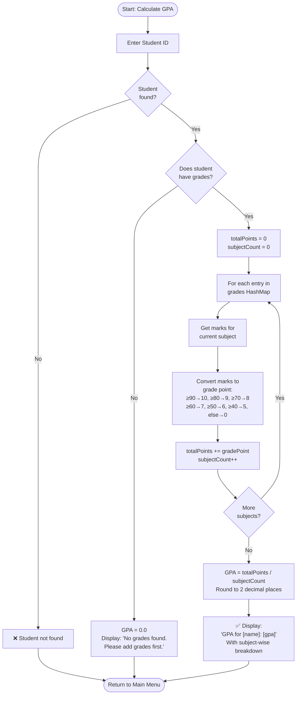

# Program Flowcharts

> Visual representation of the Student Record Management System program flow using Mermaid diagrams.

---

## 1. Main Program Flowchart

This flowchart shows the complete program flow from startup through the main menu to each operation and back.

---

## 2. Add Student — Detailed Flowchart

This flowchart shows the detailed process of adding a new student record, including all input validation steps.

---

## 3. Search Student — Sub-Menu Flowchart

---

## 4. GPA Calculation — Process Flowchart

---

## 5. Legend

| Symbol | Meaning |
|--------|---------|
| 🟢 Rounded rectangle | Start / End terminal |
| 📋 Rectangle | Process / Action step |
| ◇ Diamond | Decision / Condition |
| ➡️ Arrow | Flow direction |
| ❌ Red text | Error handling |
| ✅ Green text | Success message |

---

*These flowcharts were created using Mermaid.js syntax and can be rendered in any Mermaid-compatible viewer (VS Code, GitHub, etc.).*
