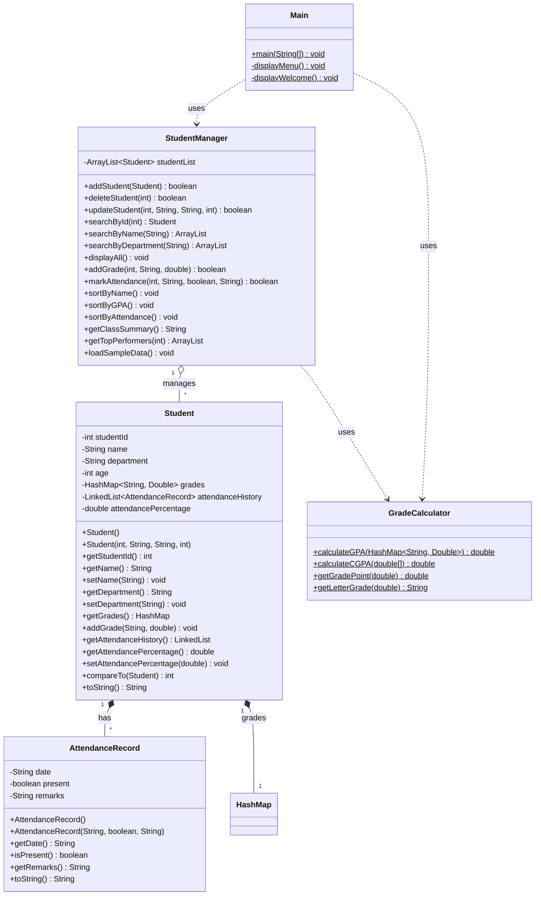
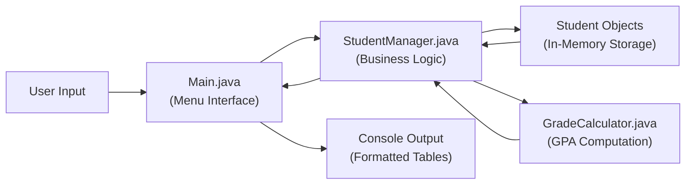
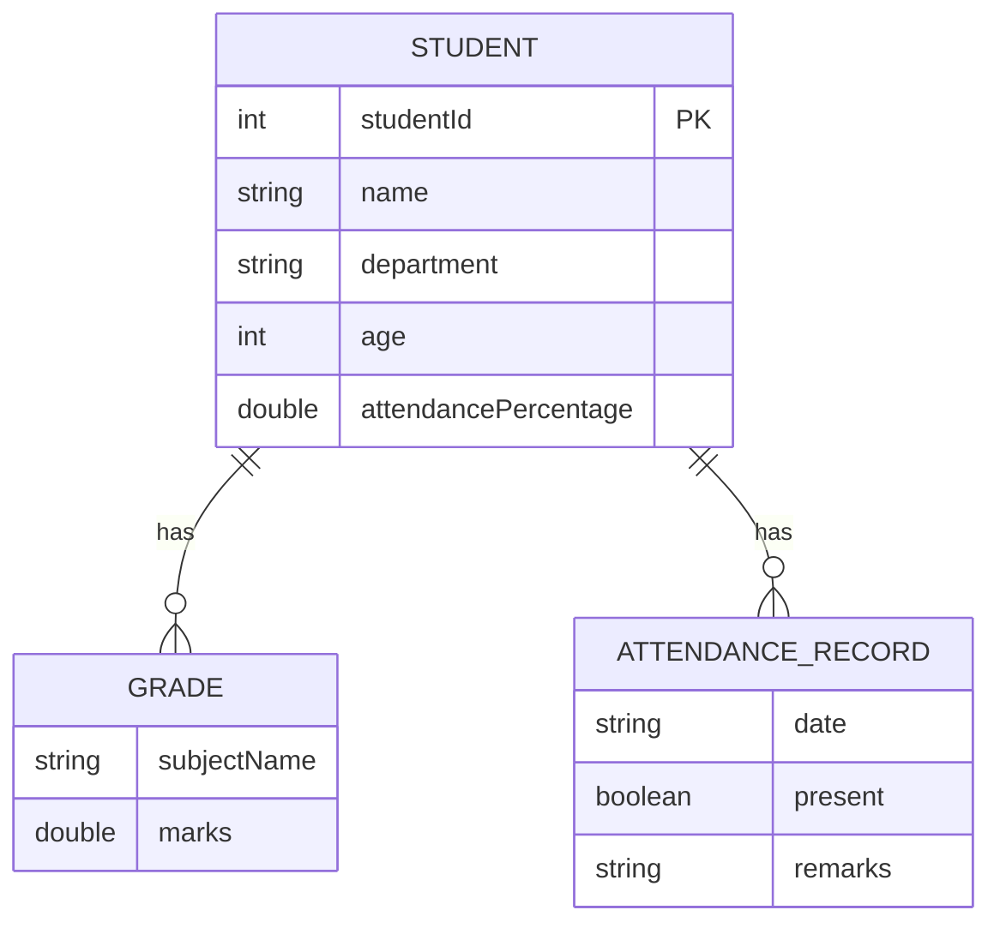

# Student Record Management System — Project Report

---

<div align="center">

## 📘 TITLE PAGE

### **Student Record Management System**

**A Mini-Project Report**

Submitted in partial fulfilment of the requirements for the degree of

**Bachelor of Engineering**

in

**________________ (Branch Name)**

by

| Field | Details |
|-------|---------|
| **Student Name** | ________________ |
| **Roll Number** | ________________ |
| **Department** | ________________ |
| **Guide Name** | ________________ |
| **College** | ________________ |
| **University** | ________________ |
| **Academic Year** | 2025–2026 |

</div>

---

## 📜 CERTIFICATE

> This is to certify that the mini-project entitled **"Student Record Management System"** has been successfully completed by **________________ (Roll No: ________)** in partial fulfilment of the requirements for the award of the degree of Bachelor of Engineering in **________________** during the academic year **2025–2026**.

| | |
|---|---|
| **Project Guide** | **Head of Department** |
| ________________ | ________________ |
| Date: ____________ | Date: ____________ |

| |
|---|
| **External Examiner** |
| ________________ |
| Date: ____________ |

---

## 🙏 ACKNOWLEDGEMENT

I would like to express my sincere gratitude to my project guide, **Prof. ________________**, for their constant guidance, support, and encouragement throughout the development of this project. Their valuable suggestions and constructive feedback helped me improve the quality and completeness of this work.

I am also thankful to **Prof. ________________**, Head of Department, for providing the necessary facilities and an environment conducive to learning and project development.

I extend my appreciation to all the faculty members of the **________________ Department** for their teaching and encouragement that provided me with the foundational knowledge required to undertake this project.

I am grateful to my classmates and friends for their support, helpful discussions, and willingness to test the application during the development phase.

Finally, I thank my parents and family for their unwavering support and motivation throughout my academic journey.

---

## 📝 ABSTRACT

The **Student Record Management System** is a console-based application developed in Core Java that enables efficient management of student academic records. The system provides a comprehensive set of features including adding, deleting, updating, and searching student records, automatic GPA and CGPA calculation on a 10-point grading scale, attendance tracking with chronological history logs, and multi-criteria sorting and searching capabilities.

The application is built using Object-Oriented Programming principles and leverages the Java Collections Framework — specifically `ArrayList`, `HashMap`, and `LinkedList` — to store and manage data efficiently. The user interacts with the system through a text-based menu interface that presents options in a clear and organized manner, with formatted table outputs using box-drawing characters for enhanced readability.

This project serves as a practical demonstration of core Java concepts including encapsulation, composition, the `Comparable` interface, static utility methods, and exception handling. It is designed as an educational mini-project suitable for 1st year engineering students learning Java programming, data structures, and software development fundamentals. The system can manage student records entirely in-memory during program execution, making it lightweight and easy to compile and run without any external dependencies.

---

## 📑 TABLE OF CONTENTS

| Chapter | Title | 
|---------|-------|
| 1 | [Introduction](#chapter-1-introduction) |
| 2 | [System Requirements](#chapter-2-system-requirements) |
| 3 | [System Design](#chapter-3-system-design) |
| 4 | [Implementation](#chapter-4-implementation) |
| 5 | [Data Structures Used](#chapter-5-data-structures-used) |
| 6 | [OOP Concepts Applied](#chapter-6-oop-concepts-applied) |
| 7 | [Testing](#chapter-7-testing) |
| 8 | [Screenshots](#chapter-8-screenshots) |
| 9 | [Conclusion & Future Scope](#chapter-9-conclusion--future-scope) |
| — | [References](#references) |

---

## Chapter 1: Introduction

### 1.1 Background

In every educational institution, managing student records is a fundamental administrative task. Traditional paper-based methods are slow, error-prone, and difficult to search through. With the increasing adoption of technology in education, there is a growing need for simple, reliable, and efficient systems to handle student data.

This project, the **Student Record Management System**, addresses this need by providing a lightweight, console-based Java application that can store, retrieve, update, and delete student records. It is designed to demonstrate the practical application of programming concepts learned during the first year of engineering.

### 1.2 Problem Statement

Educational institutions need a simple and efficient way to manage student academic records including personal details, grades, GPA calculations, and attendance tracking. A system is needed that can:
- Store student records reliably during a session
- Perform CRUD (Create, Read, Update, Delete) operations
- Calculate GPA automatically based on subject grades
- Track and report attendance
- Allow searching and sorting of records by multiple criteria

### 1.3 Objectives

The primary objectives of this project are:

1. To develop a fully functional student record management system using Core Java
2. To implement CRUD operations for student data management
3. To provide automatic GPA/CGPA calculation using a 10-point grading scale
4. To enable attendance tracking with a detailed history log
5. To demonstrate the effective use of OOP principles and Java Collections
6. To provide a clean, user-friendly console interface with formatted output

### 1.4 Scope

This project covers the following scope:
- **In Scope:** In-memory data management, GPA calculation, attendance tracking, searching, sorting, and formatted console display
- **Out of Scope:** Persistent database storage, graphical user interface (GUI), network/multi-user access, and authentication

---

## Chapter 2: System Requirements

### 2.1 Hardware Requirements

| Component | Minimum Requirement |
|-----------|-------------------|
| Processor | Intel Core i3 or equivalent |
| RAM | 2 GB |
| Disk Space | 100 MB (for JDK installation) |
| Display | Standard monitor with text display support |

### 2.2 Software Requirements

| Software | Version / Details |
|----------|------------------|
| Operating System | Windows 10/11, Linux, or macOS |
| Java Development Kit (JDK) | Version 8 or higher |
| IDE / Editor | VS Code with Java Extension Pack (recommended) |
| Build Tool | `javac` compiler (included with JDK) |
| External Libraries | None (pure Core Java) |

### 2.3 JDK Installation & Verification

To verify that Java is installed correctly, run the following command:

```bash
java -version
javac -version
```

Expected output:

```
java version "1.8.0_xxx" (or higher)
javac 1.8.0_xxx (or higher)
```

---

## Chapter 3: System Design

### 3.1 System Architecture

The system follows a layered architecture with clear separation of concerns:

- **Presentation Layer** — `Main.java` handles the menu interface and user interaction
- **Business Logic Layer** — `StudentManager.java` contains all CRUD operations and data processing
- **Utility Layer** — `GradeCalculator.java` provides GPA/CGPA calculation methods
- **Model Layer** — `Student.java` and `AttendanceRecord.java` define the data models

### 3.2 Class Diagram



### 3.3 Data Flow Diagram



### 3.4 Entity Relationship



---

## Chapter 4: Implementation

### 4.1 Student.java — The Model Class

The `Student` class serves as the primary data model. It encapsulates all student-related information including personal details, grades, and attendance history.

**Key Design Decisions:**
- Fields are declared `private` to enforce encapsulation
- A `HashMap<String, Double>` stores subject-wise grades, enabling O(1) lookup by subject name
- A `LinkedList<AttendanceRecord>` maintains chronological attendance history, allowing efficient insertion at the end
- The class implements `Comparable<Student>` to enable natural ordering by student ID

```java
public class Student implements Comparable<Student> {
    private int studentId;
    private String name;
    private String department;
    private int age;
    private HashMap<String, Double> grades;
    private LinkedList<AttendanceRecord> attendanceHistory;
    private double attendancePercentage;

    // Parameterized constructor
    public Student(int studentId, String name, String department, int age) {
        this.studentId = studentId;
        this.name = name;
        this.department = department;
        this.age = age;
        this.grades = new HashMap<>();
        this.attendanceHistory = new LinkedList<>();
        this.attendancePercentage = 0.0;
    }

    @Override
    public int compareTo(Student other) {
        return Integer.compare(this.studentId, other.studentId);
    }
}
```

### 4.2 AttendanceRecord.java — Attendance Log Entry

A simple model class representing a single attendance entry with the date, presence status, and optional remarks.

```java
public class AttendanceRecord {
    private String date;
    private boolean present;
    private String remarks;

    public AttendanceRecord(String date, boolean present, String remarks) {
        this.date = date;
        this.present = present;
        this.remarks = remarks;
    }
}
```

### 4.3 StudentManager.java — Business Logic

The `StudentManager` class is the core of the application. It maintains an `ArrayList<Student>` and provides all operations:

- **addStudent()** — Validates for duplicate ID before adding
- **deleteStudent()** — Finds and removes student by ID
- **updateStudent()** — Locates the student and modifies fields
- **searchById()** — Linear search through the list
- **searchByName()** — Partial match using `String.contains()`
- **sortByName()** — Uses `Collections.sort()` with a `Comparator`
- **sortByGPA()** — Custom comparator on calculated GPA values
- **loadSampleData()** — Pre-populates sample student records for demo

### 4.4 GradeCalculator.java — Utility Class

A utility class with all `static` methods for GPA computation:

```java
public class GradeCalculator {
    public static double calculateGPA(HashMap<String, Double> grades) {
        if (grades.isEmpty()) return 0.0;
        double totalPoints = 0;
        for (double marks : grades.values()) {
            totalPoints += getGradePoint(marks);
        }
        return totalPoints / grades.size();
    }

    public static double getGradePoint(double marks) {
        if (marks >= 90) return 10.0;
        else if (marks >= 80) return 9.0;
        else if (marks >= 70) return 8.0;
        else if (marks >= 60) return 7.0;
        else if (marks >= 50) return 6.0;
        else if (marks >= 40) return 5.0;
        else return 0.0;
    }
}
```

### 4.5 Main.java — Entry Point

The `Main` class provides the text-based menu interface. It uses a `Scanner` for input and a `while` loop to keep the menu running until the user chooses to exit. Each menu option maps to a corresponding method call in `StudentManager`.

**Menu Structure:**
- A `switch-case` statement handles all 15 menu options
- Input validation is performed using `try-catch` blocks for `InputMismatchException`
- A welcome screen with ASCII art is displayed on startup

---

## Chapter 5: Data Structures Used

### 5.1 ArrayList

**What it is:** A resizable array implementation of the `List` interface. It stores elements in a contiguous block of memory and provides index-based access.

**Where used:** The main `studentList` in `StudentManager` is an `ArrayList<Student>`.

**Why chosen:**
- Dynamic resizing — we don't know how many students will be added
- Index-based access for sequential display
- Built-in `Collections.sort()` support for sorting operations
- Easy iteration using enhanced for-loop

### 5.2 HashMap

**What it is:** A hash table implementation of the `Map` interface. It stores key-value pairs and provides O(1) average-case lookup.

**Where used:** Each `Student` object contains a `HashMap<String, Double>` mapping subject names to marks/grades.

**Why chosen:**
- O(1) average lookup by subject name
- No duplicate subject entries (keys are unique)
- Easy to iterate over all subjects for GPA calculation
- Natural mapping of subject → grade relationship

### 5.3 LinkedList

**What it is:** A doubly-linked list implementation of the `List` and `Deque` interfaces. Each element is stored in a node with references to the previous and next nodes.

**Where used:** Each `Student` object contains a `LinkedList<AttendanceRecord>` for attendance history.

**Why chosen:**
- Efficient O(1) insertion at the end (new attendance records are always appended)
- Chronological order is naturally maintained
- No need for random access — attendance is typically viewed sequentially
- Memory is allocated per-node, so no wasted pre-allocated space

### 5.4 Comparison Summary

| Feature | ArrayList | HashMap | LinkedList |
|---------|-----------|---------|------------|
| **Access by Index** | O(1) | N/A | O(n) |
| **Search** | O(n) | O(1) avg | O(n) |
| **Insert at End** | O(1) amortized | O(1) avg | O(1) |
| **Delete** | O(n) | O(1) avg | O(n) |
| **Memory** | Contiguous | Hash table + buckets | Nodes with pointers |
| **Order** | Insertion order | No guaranteed order | Insertion order |
| **Use Case** | Student list | Subject-grade map | Attendance log |

---

## Chapter 6: OOP Concepts Applied

### 6.1 Classes and Objects

A **class** is a blueprint for creating objects. An **object** is an instance of a class.

**In this project:** `Student`, `AttendanceRecord`, `StudentManager`, and `GradeCalculator` are classes. When a new student is added, a `Student` object is created using the `new` keyword.

```java
Student s = new Student(1001, "Rahul Sharma", "CSE", 18);
```

### 6.2 Encapsulation

**Encapsulation** is the bundling of data (fields) and methods that operate on that data into a single unit (class), with access to the data restricted through access modifiers.

**In this project:** All fields in `Student` and `AttendanceRecord` are declared `private`. Access is provided through `public` getter and setter methods.

```java
private String name;            // Private field
public String getName() {       // Public getter
    return name;
}
public void setName(String name) {  // Public setter
    this.name = name;
}
```

### 6.3 Constructors

A **constructor** is a special method called when an object is created. It initializes the object's state.

**Types used:**
- **Default constructor** — No-argument constructor for creating empty objects
- **Parameterized constructor** — Accepts values to initialize fields at creation time

### 6.4 Composition (Has-A Relationship)

**Composition** means that a class contains objects of other classes as fields, representing a "has-a" relationship.

**In this project:**
- A `Student` **has-a** `HashMap` of grades
- A `Student` **has-a** `LinkedList` of `AttendanceRecord` objects
- A `StudentManager` **has-a** `ArrayList` of `Student` objects

### 6.5 Comparable Interface

The `Comparable<T>` interface defines a natural ordering for objects of a class by implementing the `compareTo()` method.

**In this project:** `Student implements Comparable<Student>`, comparing students by their student IDs. This allows `Collections.sort()` to sort students by ID by default.

### 6.6 Static Methods

**Static methods** belong to the class rather than to any specific object. They can be called without creating an object.

**In this project:** All methods in `GradeCalculator` are static — `calculateGPA()`, `getGradePoint()`, `getLetterGrade()`.

```java
double gpa = GradeCalculator.calculateGPA(student.getGrades());
```

### 6.7 Exception Handling

**Exception handling** manages runtime errors gracefully using `try-catch` blocks.

**In this project:** User input is wrapped in `try-catch` blocks to handle `InputMismatchException` (when the user enters text instead of a number), preventing program crashes.

---

## Chapter 7: Testing

### 7.1 Test Cases

| # | Test Case | Input | Expected Output | Actual Output | Status |
|---|-----------|-------|-----------------|---------------|--------|
| 1 | Add a new student | ID: 1001, Name: "Rahul", Dept: "CSE", Age: 18 | "Student added successfully" | Student added successfully | ✅ Pass |
| 2 | Add duplicate student ID | ID: 1001 (already exists) | "Student ID already exists" | Student ID already exists | ✅ Pass |
| 3 | Delete existing student | ID: 1001 | "Student deleted successfully" | Student deleted successfully | ✅ Pass |
| 4 | Delete non-existent student | ID: 9999 | "Student not found" | Student not found | ✅ Pass |
| 5 | Search by valid ID | ID: 1002 | Display student details | Student details displayed | ✅ Pass |
| 6 | Search by invalid ID | ID: 0 | "Student not found" | Student not found | ✅ Pass |
| 7 | Search by name (partial) | Name: "Ra" | All students with "Ra" in name | Matching students displayed | ✅ Pass |
| 8 | Add grades to student | ID: 1001, Subject: "Math", Marks: 85 | "Grade added successfully" | Grade added successfully | ✅ Pass |
| 9 | Calculate GPA | Student with grades 85, 90, 70 | GPA: 9.0 | GPA: 9.0 | ✅ Pass |
| 10 | Mark attendance | ID: 1001, Date: "2026-01-15", Present: Yes | "Attendance marked" | Attendance marked | ✅ Pass |
| 11 | Sort by name | Select sort by name | Alphabetical order | Alphabetically sorted | ✅ Pass |
| 12 | Sort by GPA | Select sort by GPA | Descending GPA order | Sorted by GPA descending | ✅ Pass |
| 13 | Invalid menu option | Enter: 99 | "Invalid option" message | Invalid option displayed | ✅ Pass |
| 14 | Non-numeric input for ID | Enter: "abc" | Error message, re-prompt | Error handled gracefully | ✅ Pass |
| 15 | Load sample data | Select option 14 | 5 sample students loaded | Sample data loaded | ✅ Pass |

### 7.2 Boundary Testing

| Test | Input | Expected Behavior |
|------|-------|-------------------|
| Empty student list display | No students added | "No students found" message |
| GPA with no grades | Student has no grades | GPA = 0.0 |
| Marks = 100 | Maximum marks | Grade Point = 10.0 |
| Marks = 0 | Minimum marks | Grade Point = 0.0 |
| Very long name | 100-character name | Accepted and displayed (truncated in table) |

---

## Chapter 8: Screenshots

### 8.1 Welcome Screen
> *[Insert screenshot of the welcome ASCII art and menu display]*

### 8.2 Main Menu
> *[Insert screenshot showing all 15 menu options]*

### 8.3 Add Student
> *[Insert screenshot of adding a new student with all fields]*

### 8.4 Display All Students
> *[Insert screenshot of the formatted table with box-drawing characters]*

### 8.5 GPA Calculation
> *[Insert screenshot showing GPA calculation for a student]*

### 8.6 Attendance Report
> *[Insert screenshot of attendance history display]*

### 8.7 Sort Students
> *[Insert screenshot of sorted student list]*

### 8.8 Class Summary Report
> *[Insert screenshot of overall class summary statistics]*

> **Note:** To capture screenshots, run the program, perform the operation, and use `Win + Shift + S` (Windows) or `Cmd + Shift + 4` (Mac) to capture the console output.

---

## Chapter 9: Conclusion & Future Scope

### 9.1 Conclusion

The **Student Record Management System** has been successfully designed and implemented using Core Java. The system fulfils all stated objectives — it provides complete CRUD operations for student records, automatic GPA calculation, attendance tracking, and multi-criteria searching and sorting capabilities.

Through this project, the following learning outcomes were achieved:
- Practical understanding of Object-Oriented Programming concepts (encapsulation, composition, interfaces)
- Hands-on experience with the Java Collections Framework (ArrayList, HashMap, LinkedList)
- Understanding of algorithm design for searching and sorting
- Experience in designing user-friendly console interfaces
- Skills in software testing and validation

The project demonstrates that a functional and useful application can be built using only Core Java without any external libraries or frameworks.

### 9.2 Future Scope

The system can be enhanced in several ways:

| Enhancement | Description |
|-------------|-------------|
| **Database Integration** | Use MySQL or SQLite to persist data between sessions via JDBC |
| **Graphical User Interface** | Build a GUI using Java Swing or JavaFX for better usability |
| **File Storage** | Save/load data to/from CSV or JSON files for simple persistence |
| **Login System** | Add admin/student authentication with role-based access |
| **Report Export** | Generate PDF or Excel reports for academic records |
| **Multi-class Support** | Manage multiple classes/sections within the same system |
| **Web Application** | Convert to a web application using Spring Boot |
| **Email Notifications** | Send attendance alerts and grade reports via email |

---

## References

1. **Java Documentation** — Oracle, "The Java™ Tutorials," [https://docs.oracle.com/javase/tutorial/](https://docs.oracle.com/javase/tutorial/)
2. **Herbert Schildt**, *Java: The Complete Reference*, 12th Edition, McGraw-Hill Education, 2021
3. **E. Balagurusamy**, *Programming with Java: A Primer*, 6th Edition, McGraw-Hill Education, 2019
4. **Java Collections Framework** — Oracle, [https://docs.oracle.com/javase/8/docs/technotes/guides/collections/](https://docs.oracle.com/javase/8/docs/technotes/guides/collections/)
5. **GeeksforGeeks** — "ArrayList in Java," [https://www.geeksforgeeks.org/arraylist-in-java/](https://www.geeksforgeeks.org/arraylist-in-java/)
6. **W3Schools** — "Java Tutorial," [https://www.w3schools.com/java/](https://www.w3schools.com/java/)
7. **Cay S. Horstmann**, *Core Java Volume I: Fundamentals*, 12th Edition, Prentice Hall, 2021

---

*Report prepared on: May 2026*

*This document was prepared as part of the academic mini-project requirement for the 1st year B.E. program.*
